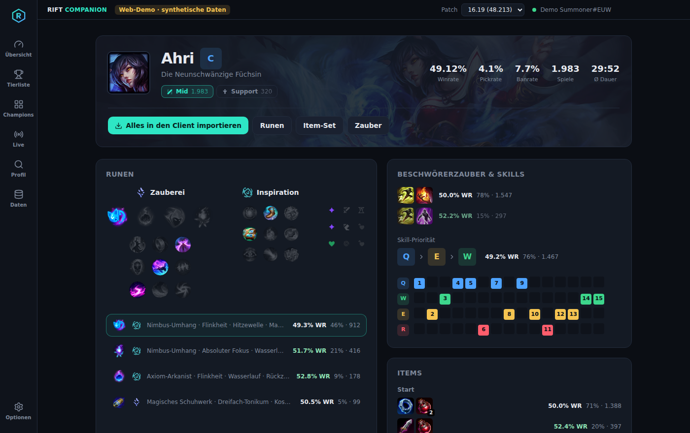
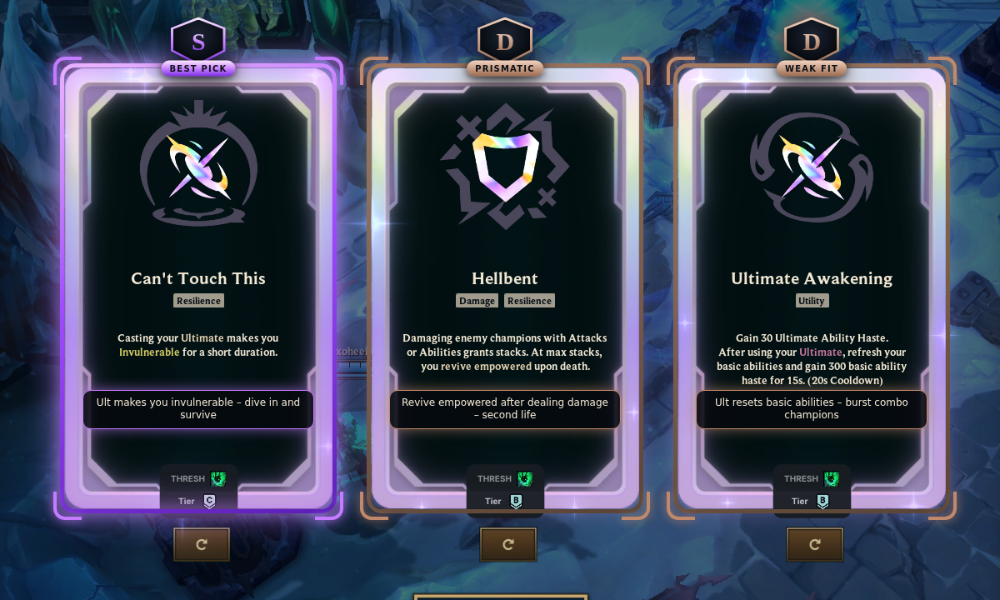
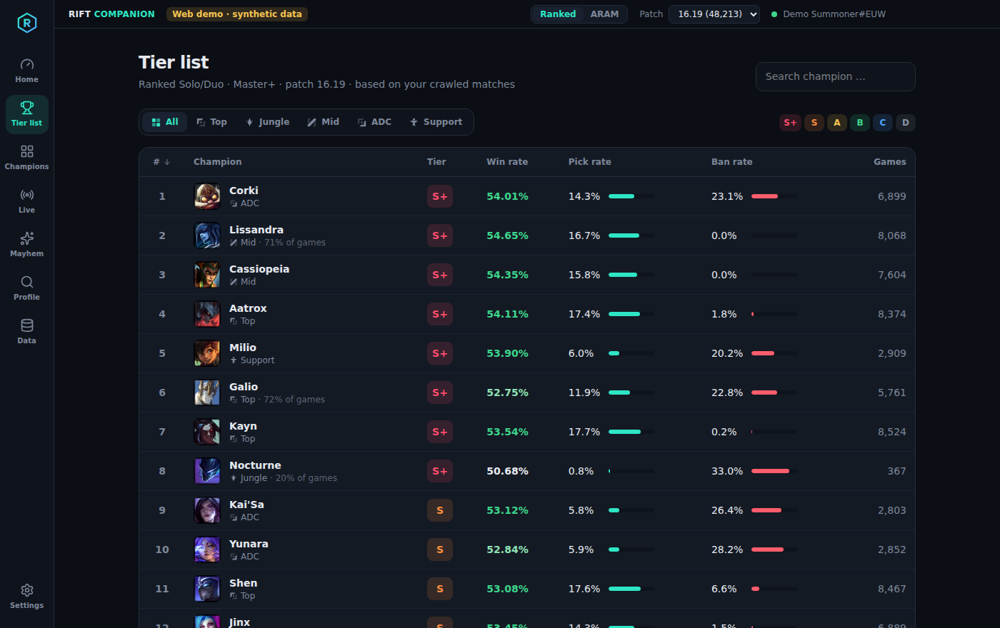
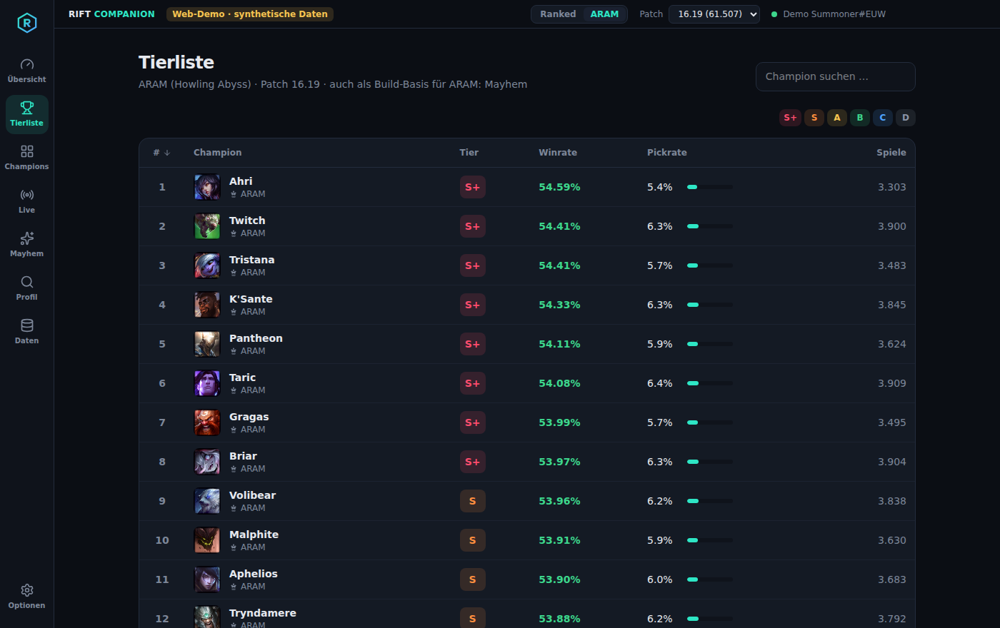
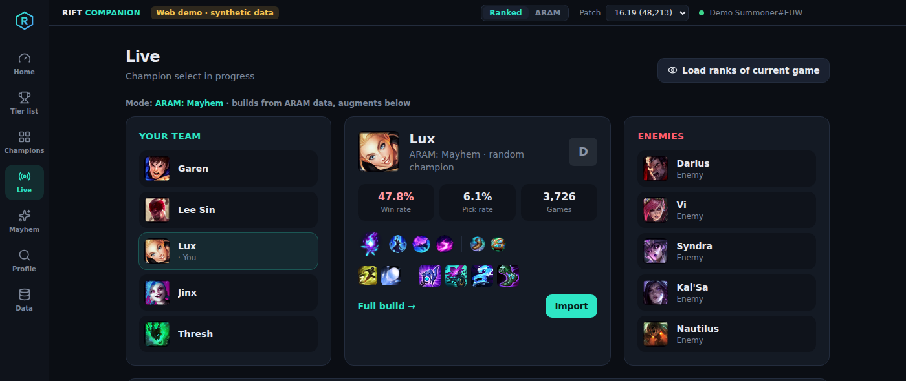
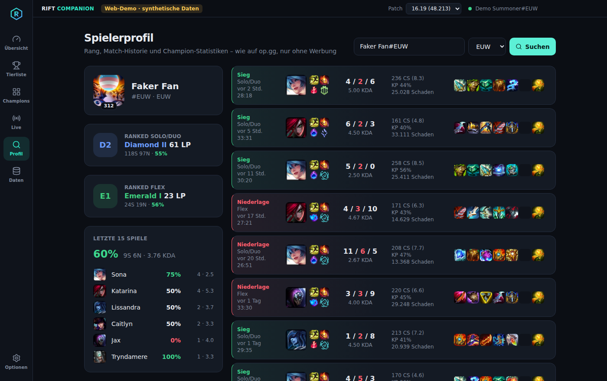
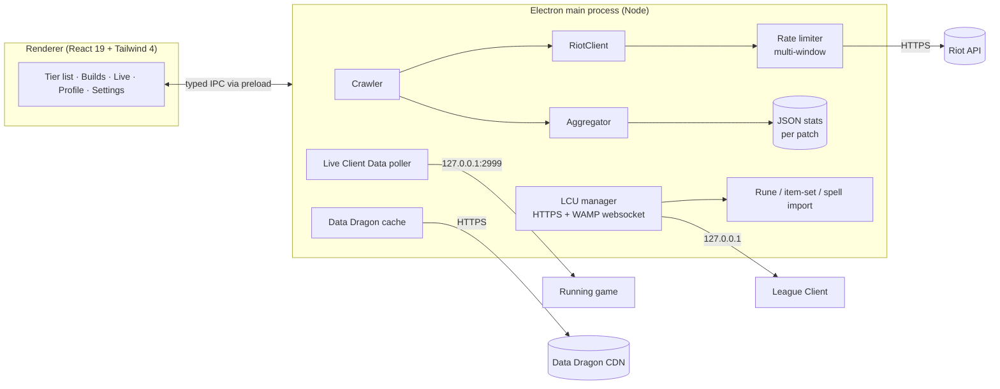

<div align="center">


# ratioAI

**A psychedelic, ad-free League of Legends companion app – tier lists, builds, runes, auto-import, ARAM & ARAM: Mayhem augments and live-game scouting, powered by your own Riot API crawler.**

[](https://github.com/ratioAI/ratiLoLAI/actions/workflows/ci.yml)


[**Live web demo**](https://ratioai.github.io/ratiLoLAI/) · [Download](https://github.com/ratioAI/ratiLoLAI/releases) · [Architecture](#architecture)



</div>

---

## Why?

Tools like Blitz, Porofessor or op.gg are great – but they are full of ads. ratioAI does the same job as a small, open-source desktop app **without any ads, tracking or third-party backend**. Instead of scraping someone else's statistics it ships its own **match crawler** that talks to the official Riot API and computes every number locally on your machine.

## Features

| | |
|---|---|
| 🏆 **Tier list** | S+ → D tiers per role, computed from win rate (Bayesian-smoothed), pick rate and ban rate. Sortable, filterable, searchable. |
| 📖 **Champion builds** | Most popular & best rune pages, summoner spells, starting items, core build *in purchase order*, boots, situational 4th–6th items, skill order + full 15-level skill path. |
| ⚔️ **Matchups** | Hardest and easiest lane opponents per champion and role. |
| ⚡ **Auto-import** | Detects champion select via the League Client API (LCU) and imports runes, an item set and (optionally) summoner spells the moment you lock in. Flash on D or F – your choice. |
| ✅ **Auto-accept** | Optionally accepts the ready check for you – after a random 2–6 s (or 4–8 s) delay like a person would, not the instant it pops. Accepting or declining yourself cancels it. |
| 🔴 **Live game** | Champion-select overview (allies, enemies, bans), in-game scoreboard via the Live Client Data API, and loading-screen scouting (ranks of all 10 players). |
| ❄️ **ARAM** | Separate ARAM crawler (queue 450) with its own tier list, builds, runes and auto-import. Champion select on the Howling Abyss is detected automatically; since there is no lock-in, the build is imported once your champion has stayed the same for 1.5 s (bench swaps included). |
| 🖼️ **In-game overlay** | When the augment choice appears in ARAM: Mayhem, ratioAI **recognises the three offered cards on screen** (frame detection + OCR of the card titles with a bundled Tesseract model – no memory reading, no injection) and draws a **psychedelic, wobbling tier frame** around each card (a small WebGL shader: full colour flow for S+, purple/pink for S, blue for A … dull bronze for D) with a crest, a *Best pick* marker and a one-line note. Built to stay out of the game's way: screenshots only while an augment is pending **and** the choice can open (dead, game start, after respawn/shopping), a single low-fps screen stream instead of repeated full-screen grabs, three small overlay windows instead of one full-screen surface, the animation capped at 30 fps (15 fps or static selectable), the OCR engine loaded during champion select, and the overlay excluded from screen capture. The augment you click is remembered, so later choices are rated **with the augments you already own**: a card that completes a proven combo is lifted (and labelled *Completes combo*), one that gets you closer is lifted one tier, a known trap sinks to D. Rerolls are picked up within half a second and the frames vanish as soon as the selection is closed. An optional side panel lists all augment tiers for your champion; <kbd>Alt</kbd>+<kbd>Shift</kbd>+<kbd>A</kbd> makes it look for the cards right away; League must run in borderless or windowed mode. |
| ⏱️ **Minimap timers** | Health relic respawns (the game only counts down the first spawn – ratioAI notices when a relic's green cross disappears from the minimap and counts down the 92.5 s) and inhibitor respawns, right on the minimap and on the Live page. |
| 🌀 **Loading screen** | A panel over the loading screen with every player's recent win rate in ARAM: Mayhem / ARAM (from the client's match history); <kbd>Space</kbd> shows / hides it, it disappears when the game starts. |
| ✨ **ARAM: Mayhem** | Augment tips per champion (top combos, strong picks, *traps*), proven multi-augment combinations and the most picked augments per rarity – shown in champion select, **in game** next to the scoreboard and on a dedicated page. Items & runes come from ARAM data, and your **own** Mayhem history (augments you picked, win rate) is read from the League client. |
| 👤 **Profiles** | op.gg-style player lookup: ranks, mastery, last 15 games with KDA, CS/min, items, runes and champion stats. |
| 🕷️ **Own data pipeline** | Crawls Challenger/GM/Master Solo-Queue games of one or more regions, respects Riot rate limits, resumes where it stopped, keeps separate data per patch. |
| 🔐 **Private by design** | Your API key is encrypted with the OS keychain (DPAPI/Keychain) and never leaves the main process. No telemetry. |

<p align="center"><br/><sub>In-game overlay on a real ARAM: Mayhem augment choice</sub></p>

<table>
  <tr>
    <td></td>
    <td></td>
  </tr>
  <tr>
    <td></td>
    <td></td>
  </tr>
</table>

> Screenshots are taken from the web demo, which runs on **synthetic** statistics. The desktop app only shows data it crawled itself.

### A note on ARAM: Mayhem

Riot deliberately **blocks Mayhem matches in the public API** (they return `403`) and asks developers **not to publish augment win rates**, so that the mode isn't "solved" by stat sites ([developer-relations #1109](https://github.com/RiotGames/developer-relations/issues/1109)). ratioAI respects that:

- Augment names, rarities and icons come from the game client data on [CommunityDragon](https://www.communitydragon.org/).
- Pick rates and curated combos come from the open dataset of [arammayhem.com](https://arammayhem.com/data/) (CC BY 4.0, China servers) – *Data: arammayhem.com*.
- Items, runes and skill order for Mayhem come from your own crawled **ARAM** games.
- Your personal Mayhem statistics are computed locally from your own match history in the League client and never leave your PC.
- **Augment tiers** per champion combine curated combos (top combo → S+, trap → D), the augment's pick rate within its rarity and whether it fits the champion's archetype (AP, AD, crit, on-hit, tank, enchanter). The one-line notes are hand-written.

## Getting started

### 1. Install

Download the latest `ratioAI-Setup-x.y.z.exe` from [Releases](https://github.com/ratioAI/ratiLoLAI/releases) – or build it yourself:

```bash
git clone https://github.com/ratioAI/ratiLoLAI.git
cd ratiLoLAI
npm install
npm run dev        # start in development mode
npm run dist:win   # build the Windows installer into ./release
```

Requires Node.js 20+.

### 2. Get a Riot API key

1. Sign in at [developer.riotgames.com](https://developer.riotgames.com/).
2. Copy the **Development API Key** (valid for 24 h) – or register a *Personal API Key* for long-term use.
3. Paste it in **Optionen → Riot API** inside the app and pick your region.

### 3. Crawl some games

Open **Daten**, pick *Ranked Solo/Duo* or *ARAM* and hit **Crawler starten**. The crawler fetches the apex leagues of your region(s), downloads recent ranked games including their timelines and aggregates them. With a development/personal key (100 requests / 2 min) you get roughly **20–25 matches per minute**; a few thousand matches already give a very usable tier list. Progress is stored continuously – just let it run in the background.

### Updates

Installed builds update themselves: on start (and every 4 h) the app checks GitHub Releases, downloads a new version in the background and installs it when you close the app – no manual reinstalling. For development use `npm run dev` (hot reload, nothing to install).

### 4. Play

Start the League client. ratioAI connects automatically; when you lock in a champion your runes and item set are imported.

## Architecture



```
src/
├─ main/              Electron main process
│  ├─ riot/           Riot API client + sliding-window rate limiter
│  ├─ crawler/        crawler, match/timeline aggregator, persistent stats store
│  ├─ lcu/            League client discovery, websocket events, champ select, import payloads
│  ├─ live/           Live Client Data API (in-game)
│  ├─ ddragon.ts      static data download + cache
│  └─ profile.ts      summoner profiles & live-game scouting
├─ preload/           contextBridge – exposes a typed `window.rc` API
├─ renderer/          React UI (also builds as a standalone web demo)
└─ shared/            types, tier/build analysis, static-data parsing (pure & tested)
test/                 Vitest unit + integration tests (crawler against a fake Riot API)
```

### How the numbers are computed

- **Only ranked Solo/Duo, current patch, Master+.** Remakes and games with missing positions are discarded.
- **Win rate** used for ranking is Bayesian-smoothed with 30 virtual 50 % games, so a champion with 6/6 wins doesn't end up S+.
- **Strength score** = `(smoothedWR − 50) · 100 + 0.8 · ln(1 + pickRate%) + 0.05 · banRate%`, ranked **within each role**. Tiers are percentiles: S+ top 5 %, S 15 %, A 35 %, B 60 %, C 85 %, D rest.
- **Item builds** are reconstructed from the match *timeline* (`ITEM_PURCHASED` / `ITEM_UNDO`), so the core build shows the real purchase order and undone purchases don't count.
- **Skill order** comes from `SKILL_LEVEL_UP` events; the max order is the order in which Q/W/E reach rank 5.

## Development

```bash
npm run dev         # Electron + Vite with hot reload
npm test            # Vitest (105 tests)
npm run typecheck   # strict TypeScript for main + renderer
npm run build:web   # standalone web demo in ./dist-web (synthetic data)
```

CI runs type checks, tests and both builds on every push. Tagging `v*` builds the Windows installer and attaches it to a GitHub release; `main` is deployed as the web demo to GitHub Pages.

## Is this allowed?

ratioAI only uses **official, documented interfaces**: the public Riot API, the League Client API (LCU – the same interface Blitz, Porofessor, Mobalytics etc. use for rune import) and the in-game Live Client Data API. It does not read game memory or inject anything into the game, so it is not affected by Vanguard. For personal use a development or personal API key is sufficient; if you want to distribute the app publicly with a shared key you have to register it as a product with Riot.

## Legal

ratioAI isn't endorsed by Riot Games and doesn't reflect the views or opinions of Riot Games or anyone officially involved in producing or managing Riot Games properties. Riot Games, and all associated properties are trademarks or registered trademarks of Riot Games, Inc.

Code licensed under [MIT](LICENSE).
